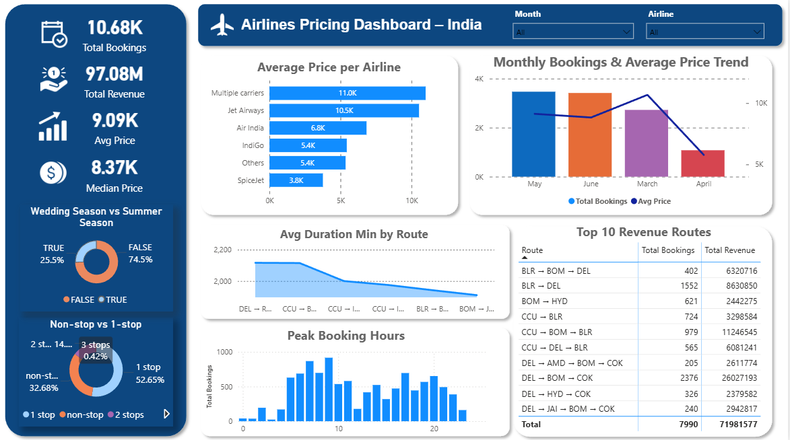

# Project: Indian Domestic Airline Market Analysis

## Project Overview
The airline industry is highly competitive with prices changing by the hour. In this project, I created a Power BI dashboard to analyze the Indian domestic airline market. The goal was to simulate a real-world business case: helping a travel agency or a new airline investor understand market trends, pricing strategies, and passenger preferences to stay competitive.

## Business Questions
To guide my analysis, I focused on answering these key business questions:
* Which flight routes are the "money-makers" (highest revenue)?
* How do different airlines compare in terms of pricing—who is the budget leader vs. the premium choice?
* What are the peak booking trends? Does time of day or seasonality affect the price?
* Does having more stops actually make a flight cheaper, or is it just about duration?

## Dataset Description
The dataset used in this analysis includes several thousand domestic flight records in India. Key information includes:
* **Airlines:** Indigo, Air India, Vistara, SpiceJet, etc.
* **Flight Details:** Source and destination cities, flight duration, and number of stops.
* **Pricing:** Ticket prices in INR.
* **Time:** Date of journey and specific booking time slots.

## Data Preparation
Before building the visuals, I spent a lot of time in **Power Query** to make sure the data was "analysis-ready." This involved:
* Cleaning up inconsistent city names and date formats.
* Creating a custom column for "Time Category" (Morning, Afternoon, Evening, Night).
* Transforming flight durations into a standardized numerical format for better calculation.
* Building a star-schema data model to keep the report fast and responsive.

## Dashboard Features
I designed the dashboard to be fully interactive so users can explore the data themselves:
* **KPI Cards:** Instant view of total revenue, average ticket price, and total bookings.
* **Dynamic Slicers:** Filter by Airline, Source City, and Destination to see specific route performance.
* **Interactive Charts:** Click on an airline in the bar chart to see their specific pricing trends across different months.
* **Map Visuals:** Geographic representation of flight traffic between major Indian hubs.

## DASHBOARD PREVIEW

## Key Insights
After exploring the dashboard, I discovered several interesting facts:
* **Route Popularity:** The Delhi-Mumbai route consistently shows the highest demand, but also the most aggressive price competition.
* **The "Stop" Premium:** Interestingly, non-stop flights are not always the most expensive; during peak hours, 1-stop flights on popular routes sometimes carry a higher price due to last-minute demand.
* **Airline Positioning:** Vistara and Air India dominate the premium segment, while Indigo maintains the highest volume of bookings through mid-range pricing.
* **Booking Window:** Flights booked for early morning departures (5 AM - 8 AM) generally show higher prices compared to late-night flights, suggesting a high volume of business travelers.

## Tools Used
* **Power BI Desktop:** For data modeling, DAX calculations, and dashboard design.
* **Microsoft Excel:** Used for initial data inspection.

## Conclusion
This dashboard provides a clear roadmap for airline management. By understanding these trends, a company can optimize their pricing for peak hours and choose the most profitable routes to increase their market share. It moves the decision-making process from "gut feeling" to being backed by actual data.
