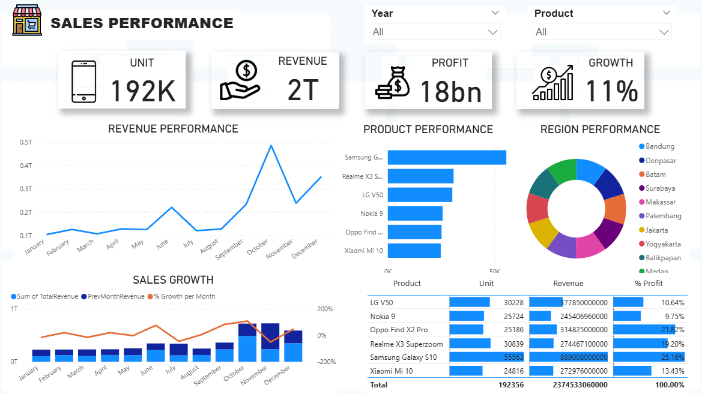

# Power BI & Business Intelligence Portfolio

Hi! I'm Nadya, an Information Technology student majoring in Business Information Systems.
This repository contains my learning projects in Power BI and Business Intelligence. Here I document my practice in working with data, starting from data cleaning and transformation to building interactive dashboards and reports. Through these projects, I learn how data can be organized, analyzed, and presented to help understand business situations more clearly.

## Key Skills Demonstrated
* **Data Cleaning & Transformation:** Fixing messy data and preparing it for analysis.
* **Data Modeling:** Connecting different data tables to work together seamlessly.
* **DAX (Data Analysis Expressions):** Writing formulas for custom calculations and business metrics.
* **Data Visualization:** Choosing the right charts to tell a clear story.
* **Dashboard Design:** Creating user-friendly layouts that are easy to navigate.
* **Business Insight Analysis:** Finding the "why" behind the numbers to provide actionable advice.

## Tools Used
* **Power BI Desktop** (Main tool for modeling and visualization)
* **Microsoft Excel** (Data sourcing and initial prep)
* **SQL Concepts** (Basic data querying and structuring)

## Featured Project: Indian Domestic Airline Market Analysis

In this project, I analyzed a dataset of domestic airline flights in India using Power BI. The main objective was to explore pricing patterns, booking behavior, and route distribution.

The dashboard presents information such as ticket prices, number of stops, booking time, and most frequent routes. Through interactive filters, users can compare non-stop and transit flights, observe price differences across routes, and see booking time trends.

From this project, I practiced data cleaning, data modeling, creating relationships between tables, and writing simple DAX measures. I also learned how to design dashboards that are readable and easy to explore.

## Practice Highlights: Sales Performance Dashboard
This dashboard was created as part of the reporting and dashboard practice module. The goal was to understand how to present sales data in a clear and interactive way using Power BI.

The report shows overall sales performance, monthly sales trends, product contribution, and regional comparison. Several visualizations such as KPI cards, line charts, and bar charts are used to help users quickly understand the data.

Through this exercise, I practiced creating calculated measures, building visual hierarchies, and organizing dashboard layouts so the information flow is easier to follow.

## Repository Structure

* **1-data-exploration/** — Initial practice on profiling and cleaning e-commerce datasets.
* **2-visualization-concepts/** — Exercises on choosing the right charts and design theory.
* **3-visualization-tools-introduction/** — My first steps in the Power BI environment.
* **4-dax-and-visualization/** — Projects focused on custom calculations and measures.
* **5-reporting-and-dashboard/** — Building multi-page reports with interactive filters.
* **6-business-intelligence-quiz/** — Summary of core BI concepts and data lifecycles.
* **7-final-project/** — The complete Indian Airline Market Analysis project.

## How to Use
1. Download and install [Power BI Desktop](https://powerbi.microsoft.com/desktop/).
2. Clone this repository or download the `.pbix` files from the project folders.
3. Open the `.pbix` file to explore the data model, DAX formulas, and interactive visuals.

## Contact
* **LinkedIn:** [https://www.linkedin.com/in/nadyahapsari-208b94205/]
* **GitHub:** [github.com/hapsariputri14](https://github.com/hapsariputri14)
